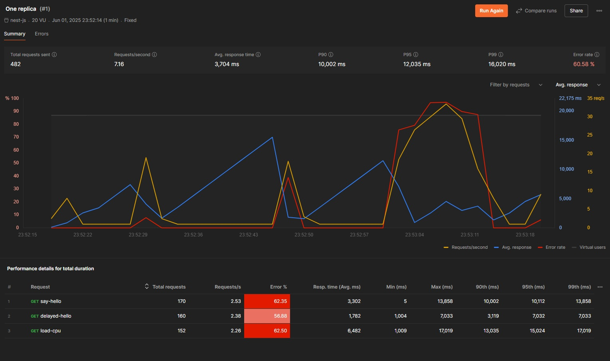
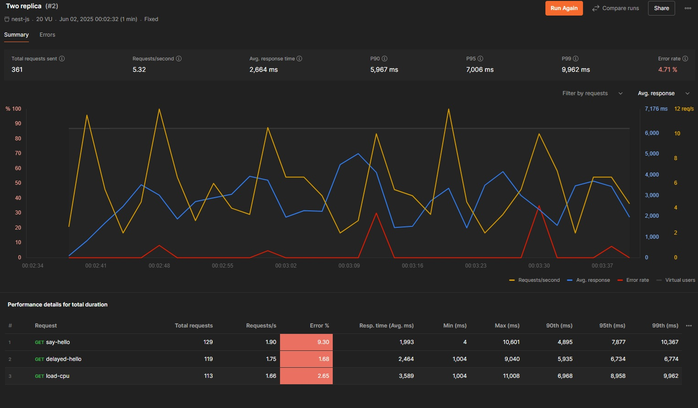
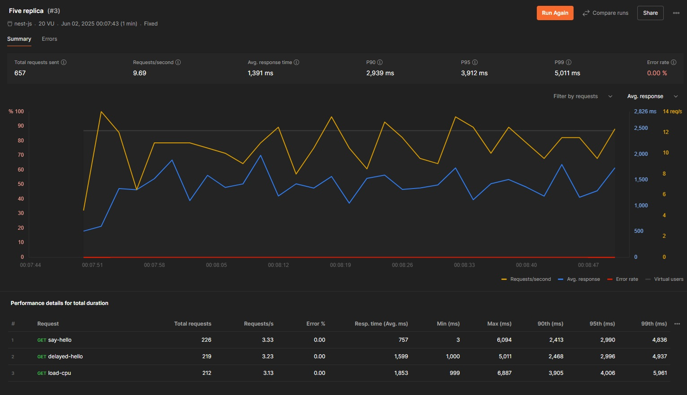
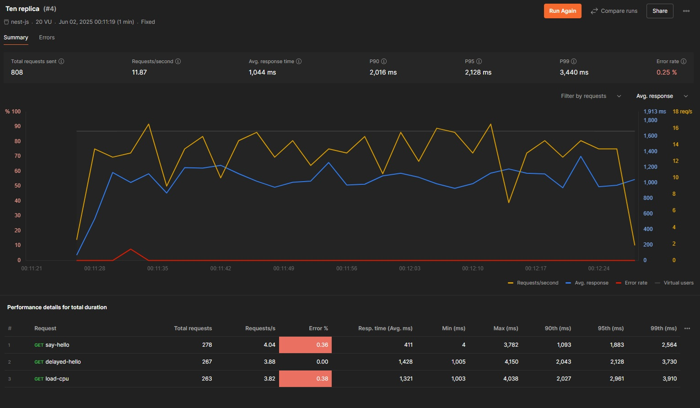

## Testing the Application

After deploying the application, you can verify that it is running and responding by using PowerShell.

### 1. Set the Base URL

Set the base URL environment variable to point to your deployed app.

> **Note:** The base URL may change depending on your deployment or tunnel address.

```powershell
$env:BASE_URL="<your app address after deployment, e.g., tunnel address>"
```

### 2. Verify the Application is Working

Run the following command to call the `/greet/say-hello` endpoint:

```powershell
curl "$env:BASE_URL/greet/say-hello"
```

You should see output similar to this:

```
StatusCode        : 200
StatusDescription : OK
Content           : {"message":"Hello World!"}
RawContent        : HTTP/1.1 200 OK
                    Connection: keep-alive
                    Keep-Alive: timeout=5
                    Content-Length: 26
                    Content-Type: application/json; charset=utf-8
                    Date: Sun, 01 Jun 2025 17:49:41 GMT
                    ETag: W/"1a-iEQ9RXvkycqsT4vWvcdH..."
Forms             : {}
Headers           : {[Connection, keep-alive], [Keep-Alive, timeout=5], [Content-Length, 26], [Content-Type,
                    application/json; charset=utf-8]...}
Images            : {}
InputFields       : {}
Links             : {}
ParsedHtml        : System.__ComObject
RawContentLength  : 26
```

---

### 3. Test Auto-Restart After Application Failure

You can simulate an application crash by calling the `/crash-app` endpoint, then monitor the pod status:

```powershell
kubectl get pods
```

Example output before crash:

```
NAME                                 READY   STATUS    RESTARTS   AGE
nestjs-deployment-8468f84874-cxgk7   1/1     Running   0          31m
```

Trigger the crash:

```powershell
curl "$env:BASE_URL/greet/crash-app"
```

You may see an error like:

```
curl : The underlying connection was closed: An unexpected error occurred on a receive.
```

Check the pods again:

```powershell
kubectl get pods
```

Pod status shortly after crash:

```
NAME                                 READY   STATUS   RESTARTS   AGE
nestjs-deployment-8468f84874-cxgk7   0/1     Error    0          31m
```

After Kubernetes restarts the pod:

```
NAME                                 READY   STATUS    RESTARTS     AGE
nestjs-deployment-8468f84874-cxgk7   0/1     Running   1 (8s ago)   31m
```

Finally, the pod should be fully ready again:

```
NAME                                 READY   STATUS    RESTARTS      AGE
nestjs-deployment-8468f84874-cxgk7   1/1     Running   1 (14s ago)   31m
```

---

### Explanation

* Initially, the pod is running fine.
* After hitting `/crash-app`, the application exits immediately.
* Because of the configured `livenessProbe` in `deployment.yaml`, Kubernetes detects the failure and restarts the pod automatically.

Example `livenessProbe` configuration:

```yaml
livenessProbe:
  httpGet:
    path: /health
    port: 3000
  initialDelaySeconds: 10
  periodSeconds: 15
```

* When the pod restarts, the `READY` status may be `0/1` initially because Kubernetes waits for the `readinessProbe` to confirm the application is ready.

Example `readinessProbe` configuration:

```yaml
readinessProbe:
  httpGet:
    path: /health
    port: 3000
  initialDelaySeconds: 5
  periodSeconds: 10
```


### 4. Do load test with different number of replicas.

The test is conducted using [Artillery](https://www.artillery.io/docs). Please install Artillery and run the `load-test.yml` file.

```node
artillery run load-test.yml
```

To scale the application, use the following command.

```powershell
kubectl scale deployment nestjs-deployment --replicas=10
```

Here are the findings

| Replicas | Total VUs Created | VUs Completed (Success) | VUs Failed | HTTP 200 Responses | ECONNRESET Errors | ETIMEDOUT Errors | Avg Response Time (ms) | Median Response Time (ms) |
| -------- | ----------------- | ----------------------- | ---------- | ------------------ | ----------------- | ---------------- | ---------------------- | ------------------------- |
| 1        | 600               | 20                      | 580        | 20                 | 352               | 228              | 5170                   | 5598                      |
| 2        | 600               | 22                      | 578        | 22                 | 303               | 275              | 5072                   | 4965                      |
| 5        | 600               | 90                      | 510        | 90                 | 270               | 240              | 5046                   | 5272                      |
| 10       | 600               | 411                     | 189        | 411                | 0 (not listed)    | 189              | 4990                   | 4867                      |

#### Observations:

* **Success rate improves with more replicas:**
  From 20 successful requests with 1 replica to 411 with 10 replicas.

* **Failures reduce as replicas increase:**
  Failed virtual users drop from 580 to 189, showing better stability.

* **Connection reset errors decrease:**
  ECONNRESET errors drop significantly from 352 (1 replica) to nearly zero or unreported at 10 replicas.

* **Timeout errors vary:**
  ETIMEDOUT errors remain somewhat high but reduce overall with more replicas.

* **Response times slightly improve:**
  Average response time decreases gradually (5170ms to 4990ms) with more replicas.

* **Request rate constant at 10/sec for 1-5 replicas, drops to 5/sec at 10 replicas:**
  This might affect interpretation of response times (fewer requests per second at 10 replicas).

---

#### Interpretation:

* Increasing replicas improves reliability and success rates significantly.
* CPU/network resource pressure reduces as replicas increase, causing fewer connection resets and timeouts.
* Response time improves slightly but still high (around 5 seconds on average).
* At 10 replicas, the system can handle more successful requests and fewer failures but still experiences some timeouts.
* You might want to look at why timeouts persist and whether further scaling or code optimization is needed.


Here are the screenshots from Postman.


#### One Replica

#### Two Replica

#### Five Replica

#### Ten Replica



